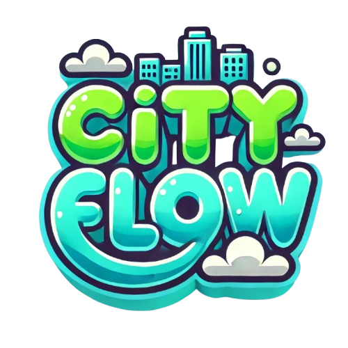

<p align="center">
  
</p>

# 🌆 CityFlow

**CityFlow** est une application web de gestion urbaine intelligente basée sur une ville fictive inspirée de Cergy. Ce projet full-stack utilise Laravel, JavaScript, Blade, Three.js et Chart.js pour permettre une exploration et une gestion immersive d'une ville connectée.

---

## 🚀 Fonctionnalités principales

- 🔍 **Exploration de la ville** (module *Explorer*) : accessible à tout utilisateur vérifié.
- 🛠️ **Gestion d’objets connectés** (module *Gestion*) :
  - *Intermédiaire* : modifier les objets.
  - *Avancé* : ajouter de nouveaux objets.
  - *Expert* : signaler des objets suspects et accéder à des statistiques détaillées.
- 👤 **Module Profil** : recherchez d’autres utilisateurs et modifiez votre profil.
- 🔐 **Module Admin** :
  - Gérer les utilisateurs et les rôles.
  - Gérer les types d’objets connectés.
  - Accéder aux logs du système.

---

## 📦 Technologies utilisées

- Laravel (PHP)
- Blade (moteur de template Laravel)
- JavaScript
- [Three.js](https://threejs.org/) pour la visualisation 3D
- [Chart.js](https://www.chartjs.org/) pour les graphiques statistiques

---

## ⚙️ Prérequis

- PHP (dernière version recommandée)
- [Composer](https://getcomposer.org/)
- [XAMPP](https://www.apachefriends.org/index.html) (ou WAMP, mais XAMPP recommandé)
- Navigateur moderne

---

## 🧪 Installation

1. **Cloner le projet :**

```bash
git clone https://github.com/votre-utilisateur/cityflow.git
cd cityflow
```

2. **Démarrer les serveurs Apache et MySQL via XAMPP.**

3. **Créer un fichier `.env` :**

Copiez le fichier `.env.example` :

```bash
cp .env.example .env
```

4. **Configurer `.env` :**
   - Assurez-vous que le nom de la base de données est bien `cityflow`
   - Configurez les identifiants SMTP pour l’envoi des mails

5. **Créer la base de données :**
   - Accédez à `phpMyAdmin`
   - Créez une base de données nommée **cityflow**

6. **Installer les dépendances PHP :**

```bash
composer install
```

7. **Générer la clé d'application :**

```bash
php artisan key:generate
```
8. **Crée un lien symbolique :**

```bash
php artisan storage:link
```

9. **Remplir la base de données :**

```bash
php artisan db:seed
```

10. **(Si erreur) Lancer les migrations :**

```bash
php artisan migrate
```


11. **Lancer le serveur :**

```bash
php artisan serve
```

---

## 🔐 Authentification

- La création de compte est nécessaire pour explorer la ville.
- La vérification du compte permet l’accès au module *Explorer*.
- Les rôles d’utilisateurs (Intermédiaire, Avancé, Expert, Admin) déterminent les accès aux différents modules.

---

## ✨ Objectif

CityFlow a pour but d’imaginer la gestion d’une ville connectée :
- Visualiser une ville en 3D
- Gérer les objets IoT
- Proposer une interface utilisateur claire et évolutive selon les compétences

---


